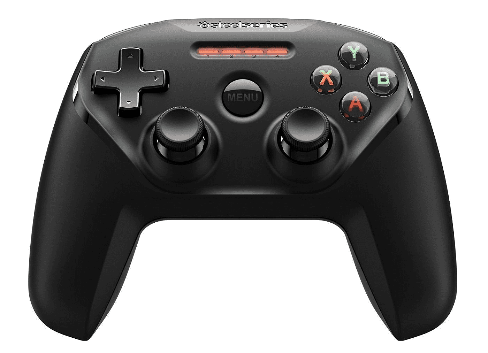
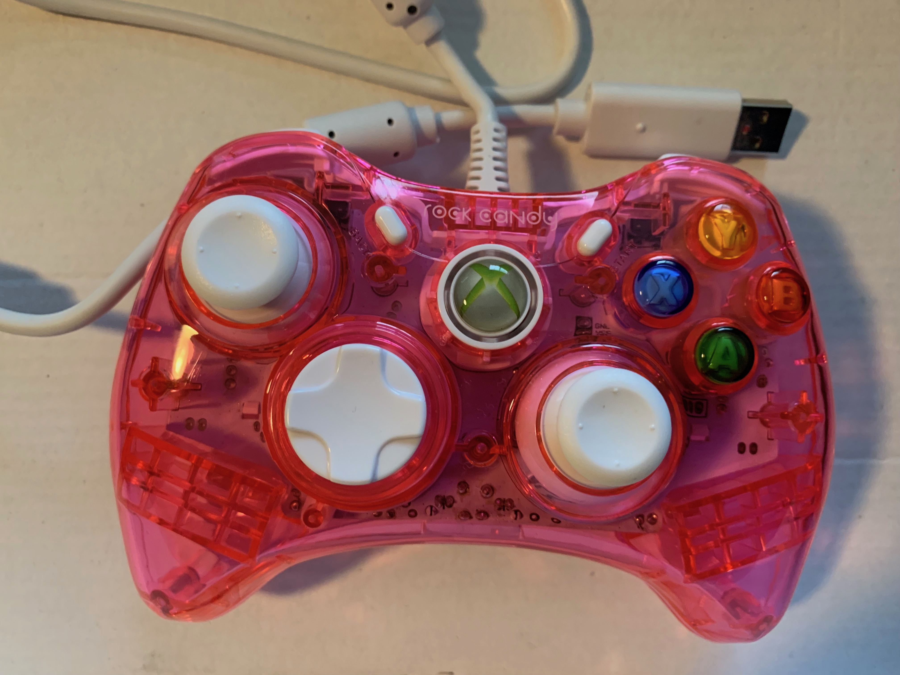
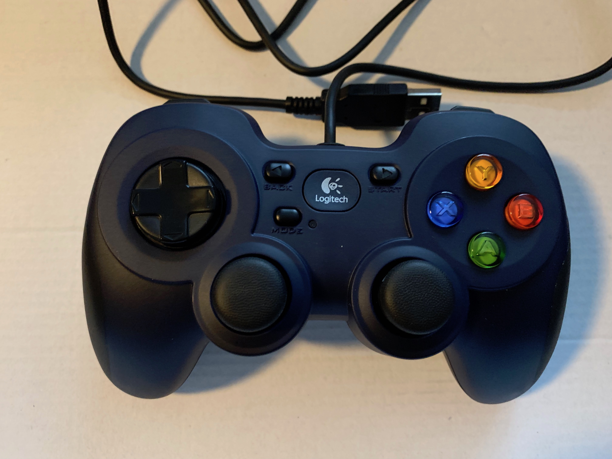
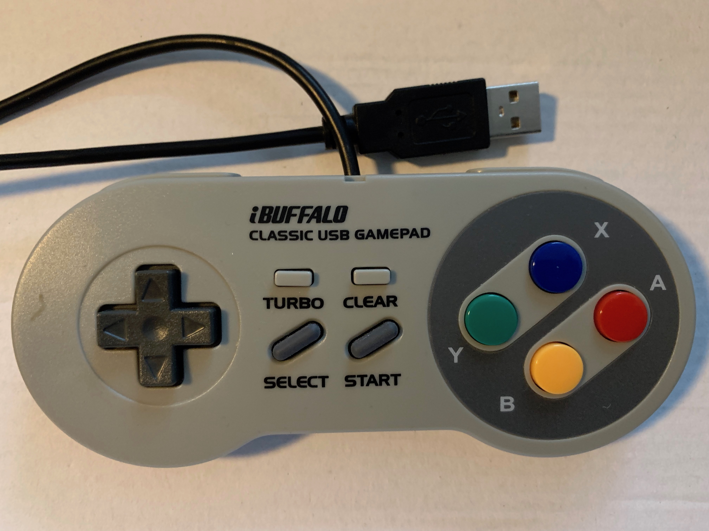
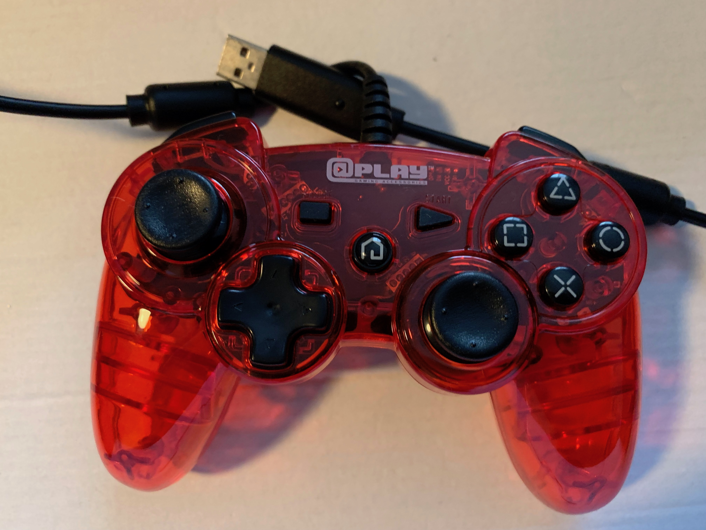
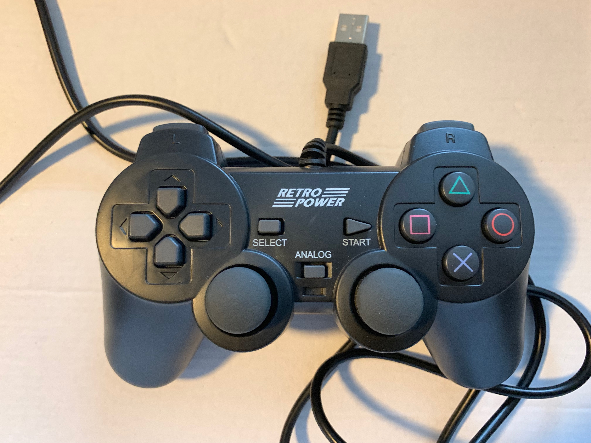
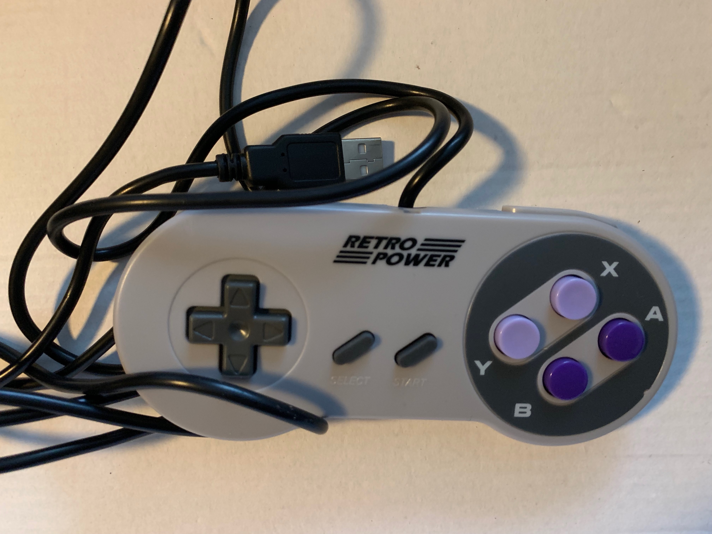
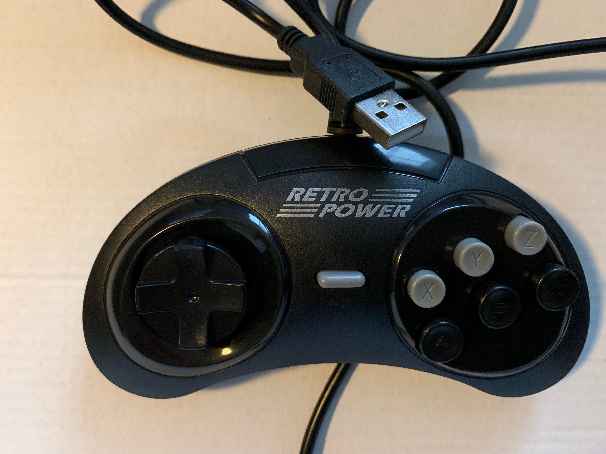
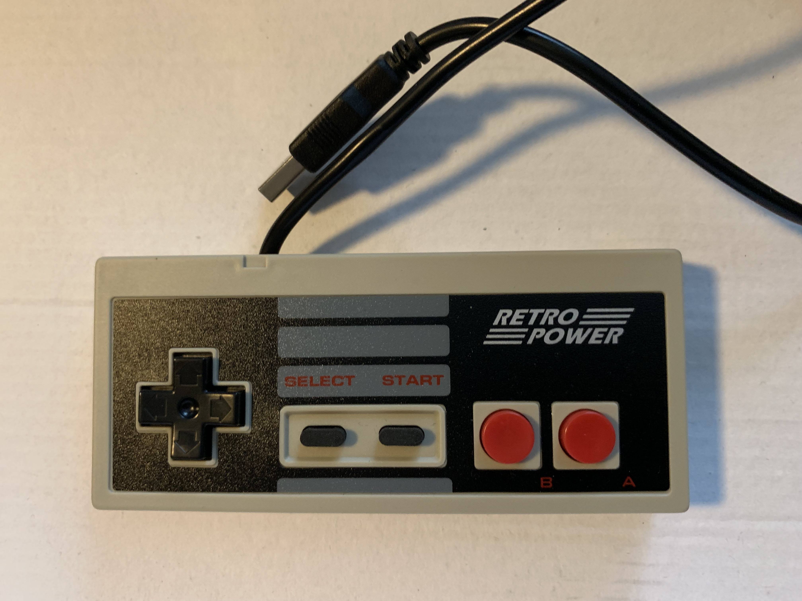

Repo for testing GameMakerStudio 2 input (keyboard, mouse, and gamepad). I wanted to see what gamepads work best with GameMakerStudio2 and how to interact with them.

Note: You probably would not use this code for moving objects in your programs.

This has been tested on:
<li>mac(from GameMakerStudio2)
<li>windows10 (from GameMakerStudio2)
<li>mac (using the HTML5 option). Tip: "Package as Loose Files", choose empty directory then you can test by using python webserver (python v2 "python2.7 -m SimpleHTTPServer 8000" or v3 "python -m http.server 8000" then open up [http://127.0.0.1:8000]() in browser.) Gamepad inputs will not work. Mouse and keyboard inputs do work as expected.
<li>iOS mac/simulator - left click works, right click does not; double click seems to work like a right click; keys initially did not work as the keyboard is not active; but I enabled the virtual keyboard (via a VK button) and it works now
<li>Ubuntu 18.04 - keyboard and mouse work as expected (have not tested gamepad)

TODO:
<li>Add virtual joysticks
<li>Simple text input
<li>Figure out how to get virtual keyboard to show on iOS and Android

 
 

Best <b>mac</b> gamepad: 

 
SteelSeries Nimbus Gamepad

 
Note: The rest of these gamepads did not work on mac.

 
<b>Windows gamepads</b>: 
 
 
XBOX 360: 

<li>everything works as expected
<li>the best one to get for Windows

 
 
Logitech F310: 

<li>most things work ok
<li>no select button
<li>there is a back button on the gamepad but the input did not register
<li>there is an X/O on bottom, but did not seem to affect outcome
<li>the second best one to get for Windows

 
 
iBuffalo Classic: 

<li>most things work ok
<li>there is turbo button on gamepad but the input did not register

 
 
Red Play: 

<li>most things did work
<li>home registers as gp_padu
<li>pad does not work
<li>avoid this one

 
 
Big Classics Retro Power gamepad: 

<li>most things work okay
<li>no select button

 
 
Retro Power PS gamepad: 

<li>most things work okay
<li>select button does not register

 
 
Retro Power Black with Purple buttons gamepad: 

<li>most things work okay
<li>no gamepad up/down
<li>avoid this one

 
 
Retro Power Black Curve: 

<li>most buttons do not work
<li>avoid this one

 
 
Retro Power Brown: 

<li>most buttons do not work
<li>avoid this one

