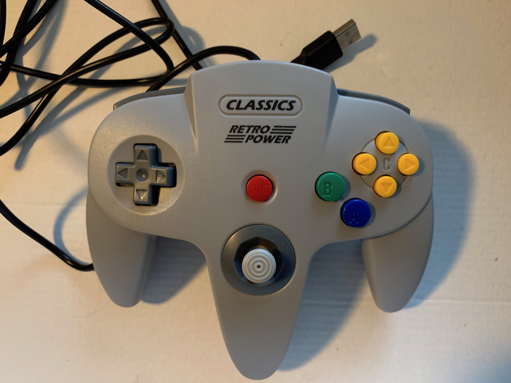

Repo for testing GameMakerStudio 2 input (keyboard, mouse, and gamepad). I wanted to see what gamepads work best with GameMakerStudio2 and how to interact with them.

Note: You probably would not use this code for moving objects in your programs.

Best <b>mac</b> gamepad: 

 
SteelSeries Nimbus Gamepad

 
Note: The rest of these gamepads did not work on mac.

 
<b>Windows gamepads</b>: 
 
 
XBOX 360: 

<li>everything works as expected
<li>the best one to get for Windows

 
 
Logitech F310: 

<li>most things work ok
<li>no select button
<li>there is a back button on the gamepad but the input did not register
<li>there is an X/O on bottom, but did not seem to affect outcome
<li>the second best one to get for Windows

 
 
iBuffalo Classic: 

<li>most things work ok
<li>there is turbo button on gamepad but the input did not register

 
 
Red Play: 

<li>most things did work
<li>home registers as gp_padu
<li>pad does not work
<li>avoid this one

 
 
Big Classics Retro Power gamepad: 

<li>most things work okay
<li>no select button

 
 
Retro Power PS gamepad: 

<li>most things work okay
<li>select button does not register

 
 
Retro Power Black with Purple buttons gamepad: 

<li>most things work okay
<li>no gamepad up/down
<li>avoid this one

 
 
Retro Power Black Curve: 

<li>most buttons do not work
<li>avoid this one

 
 
Retro Power Brown: 

<li>most buttons do not work
<li>avoid this one

